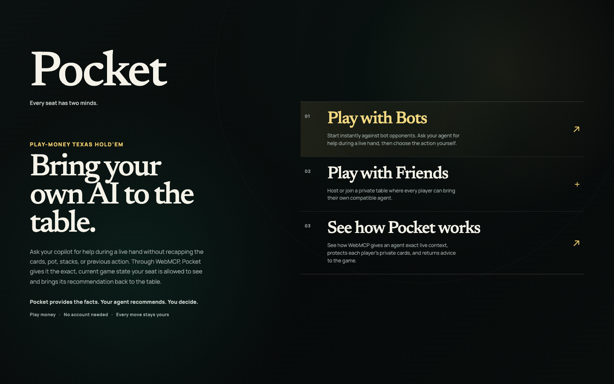
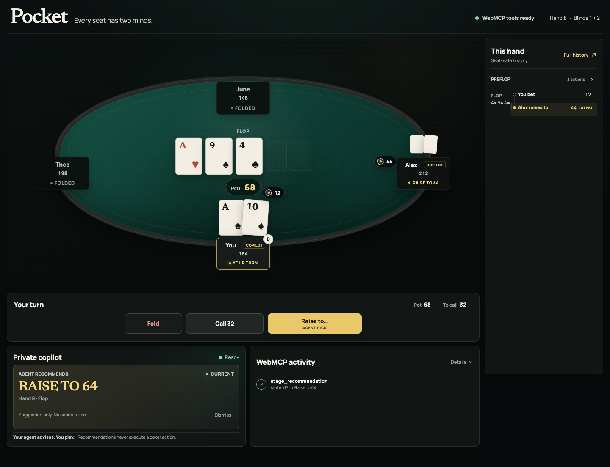

# Pocket ♠

> **Every seat has two minds.**

Pocket is a playable multiplayer Texas Hold'em game where every player can bring their own AI agent to the table.

**[Play Pocket](https://pocket-eight-rho.vercel.app) · [How it works](https://pocket-eight-rho.vercel.app/about)**

Built for the WebMCP Challenge.

> **Same table. Different players. Different private information. Different personal agents. Different private context. One authoritative application.**
>
> WebMCP connects them without requiring Pocket to own everyone's intelligence—or giving an agent control of the game.



## The idea

Most web applications have an interface for people. When an AI agent tries to help, it often has to reconstruct what is happening from the page or ask the user to explain it.

Pocket gives the agent a proper interface too.

During a hand, Pocket can give a player's agent authoritative game state, the exact legal actions, that player's private cards, and the history of how the hand developed. The agent can combine those facts with its own private user context, reason about the decision, and send a recommendation back into the live game.

But Pocket does not choose or own the agent.

### Pocket knows the table. Your agent can know you.

Pocket is authoritative about:

- the board, pot, stacks, and positions;
- whose turn it is and how the hand reached that point;
- which actions and raise totals are legal;
- and which cards a particular player is allowed to see.

A player's own agent can bring a different kind of context:

- how that person likes to play;
- strategies they are working on;
- previous hands they have discussed;
- personal notes or observations;
- and preferences about risk or style.

Pocket does not need to collect or permanently store that personal context just to offer useful assistance. The application provides what **it** knows. The user brings the intelligence and context that belongs to **them**.

## How WebMCP fits

Pocket exposes three focused WebMCP tools:

| Tool | Purpose |
| --- | --- |
| `get_current_situation` | Returns the exact seat-safe situation: private cards, public board, pot, stacks, positions, current actor, and legal actions with precise limits. |
| `get_hand_history` | Returns Pocket's authoritative, player-safe history of how the current hand developed. |
| `stage_recommendation` | Sends a structured, version-bound recommendation into Pocket's Copilot panel without playing the move. |

Together they create a complete application → agent → application loop:

```text
Pocket supplies authoritative, seat-safe state
                    ↓
agent combines it with the user's private context
                    ↓
agent reasons about the decision
                    ↓
agent stages a recommendation in Pocket
                    ↓
human follows, overrides, or dismisses it
                    ↓
human commits the poker action
```

The agent deliberately has **no tool for folding, checking, calling, betting, raising, or going all-in**.

Pocket is built around a copilot, not an autopilot.



*Pocket supplies the live facts and legal actions. The agent stages advice in the interface. The human still makes the move.*

## Why poker?

Poker makes several difficult agent-interaction problems visible at once:

- **Live shared state** — the board, pot, stacks, and betting change continuously.
- **Private state** — every player has information that other players and their agents must not receive.
- **Different participants** — several people share one application while using different agents and private context.
- **History** — a useful decision often depends on how the hand developed.
- **Exact rules** — legal actions come from the game, including precise numerical raise limits.
- **Changing state** — advice can become stale while an agent is still thinking.
- **Incomplete information** — assistance requires reasoning rather than simple retrieval.
- **Human judgment** — the agent can help without taking control.

Those are not only poker problems. Poker just makes them unusually easy to see.

## What Pocket demonstrates

### One application can remain authoritative

The agent does not have to infer the pot, interpret buttons, calculate legal raises, or trust a description typed by the player. Those facts come from the same game state that powers Pocket's interface.

### Every agent can receive a different safe view

The poker engine knows every card. A player's copilot should not.

Pocket derives a seat-safe projection for each player, so two agents connected to the same table can receive different private information while sharing the same public game.

Opponent hole cards stay hidden unless legitimately revealed at showdown. The raw deck and opaque engine state never enter browser or WebMCP responses.

### Personal context can stay with the user's agent

Pocket supplies the facts of the game while the user's chosen agent supplies preferences, memory, strategy, or other context the user has chosen to share.

The application does not need to become the permanent home for all of that information.

### Agent interaction can go both directions

WebMCP is not only used to retrieve state. `stage_recommendation` lets the agent participate visibly by returning advice to the interface where the player is making the decision.

### Agent output can have a lifetime

Every recommendation belongs to a specific game, hand, and state version. If the table changes before the advice arrives, Pocket rejects it instead of presenting stale guidance as current.

### Capability does not have to mean control

The agent can understand the situation, reason about it, and participate in the product while the consequential action remains with the person.

## What works

Pocket is a playable application, not a mock interface wrapped around a tool demo. It includes:

- complete play-money Texas Hold'em hands against bots;
- multiplayer rooms with up to two human players and bot-filled seats;
- independent seat-safe private state for every player;
- real betting, dealing, street progression, showdown, and settlement;
- persistent, reconnect-safe games and synchronized public table state;
- deterministic bot opponents and quick-tournament blind progression;
- version-bound recommendations with stale-advice rejection;
- visible follow, override, and dismissal behavior;
- responsive desktop and mobile layouts;
- an explicit no-Supabase mock route for reliable exploration;
- and automated coverage for the game, privacy boundaries, multiplayer behavior, WebMCP contracts, and core browser flows.

## Try it

Open the **[live demo](https://pocket-eight-rho.vercel.app)** and choose Play with Bots, Host a Game, or Join with a Code.

For a deterministic table that does not require Supabase, open:

```text
https://pocket-eight-rho.vercel.app/play?mode=mock
```

In ChatGPT's in-app browser or another WebMCP-enabled client, try:

> Analyze the current Pocket hand and recommend my best action. Explain your reasoning briefly and send the recommendation back to the game.

The expected sequence is:

1. The agent reads `get_current_situation`.
2. It optionally reads `get_hand_history`.
3. It reasons using Pocket's facts and any context provided by the player.
4. It calls `stage_recommendation` with the exact current `stateVersion`.
5. Pocket displays the recommendation.
6. The human chooses the actual poker action.

## Run locally

Pocket requires Node.js 22 or newer.

### Fastest path: mock table

The mock route requires no Supabase project:

```bash
npm ci
npm run dev
```

Open `http://localhost:3000/play?mode=mock`.

### Bot play and multiplayer

The full application uses Supabase for anonymous authentication, authoritative persistence, multiplayer rooms, and revision notifications.

1. Create a Supabase project and enable anonymous sign-ins.
2. Install the Supabase CLI.
3. Review and apply the migrations in `supabase/migrations`:

   ```bash
   supabase login
   supabase link --project-ref <your-project-ref>
   supabase db push
   ```

4. Create the local environment file and provide the three values described in `.env.example`:

   ```bash
   cp .env.example .env.local
   npm ci
   npm run dev
   ```

Required variables:

```text
NEXT_PUBLIC_SUPABASE_URL=
NEXT_PUBLIC_SUPABASE_PUBLISHABLE_KEY=
SUPABASE_SECRET_KEY=
```

`SUPABASE_SECRET_KEY` is server-only and must never use a `NEXT_PUBLIC_` name or be committed to source control.

## WebMCP behavior

Pocket checks for `document.modelContext` at runtime and degrades cleanly when WebMCP is unavailable. In a compatible browser environment, the table header reports **WebMCP tools ready**.

Tool registration follows the mounted table, while each invocation reads the latest state. `stage_recommendation` validates that it is still the human player's turn and that its `stateVersion`, action, and optional amount still match the current legal decision.

The same player-safe projection feeds both the visible interface and the WebMCP tools. The agent does not receive a privileged copy of the game behind the scenes.

## Architecture

```text
authoritative poker engine
          ↓
server-side game service and persistence
          ↓
seat-safe player projection
          ├──→ Pocket interface
          └──→ WebMCP tools
                    ↓
             personal agent
                    ↓
        staged recommendation only
                    ↓
             human decision
```

The engine is isolated behind a narrow adapter. Server routes validate identity, state version, and legal actions before committing a transition. Browser clients receive only whitelisted player-safe data.

## Technology

- Next.js, React, and TypeScript
- Supabase Auth, Postgres, and Realtime
- `@hivetech/poker-engine` behind a server-side adapter
- Zod for runtime validation
- Vitest and Playwright for automated verification
- Vercel for the public application

## Verification

Run the deterministic checks and production build with:

```bash
npm run check
npm run build
```

Browser scenarios live in `tests/e2e`. Multiplayer browser verification should use an isolated local Supabase environment unless managed-backend testing has been explicitly authorized.

## Repository map

```text
src/app/                 Pages and authoritative API routes
src/components/poker/    Table, seats, controls, history, and Copilot UI
src/lib/poker/           Engine adapter, game services, persistence, and safe projections
src/lib/webmcp/          WebMCP contracts and registration lifecycle
src/lib/supabase/        Browser and server Supabase clients
src/types/               Poker and WebMCP types
supabase/migrations/     Persistence, concurrency, and multiplayer schema
tests/e2e/               Browser-level product and privacy flows
```

## License

Pocket is open source under the MIT License. See `LICENSE`.

---

**Pocket supplies the truth. Your agent brings the context and intelligence. You make the move.**
